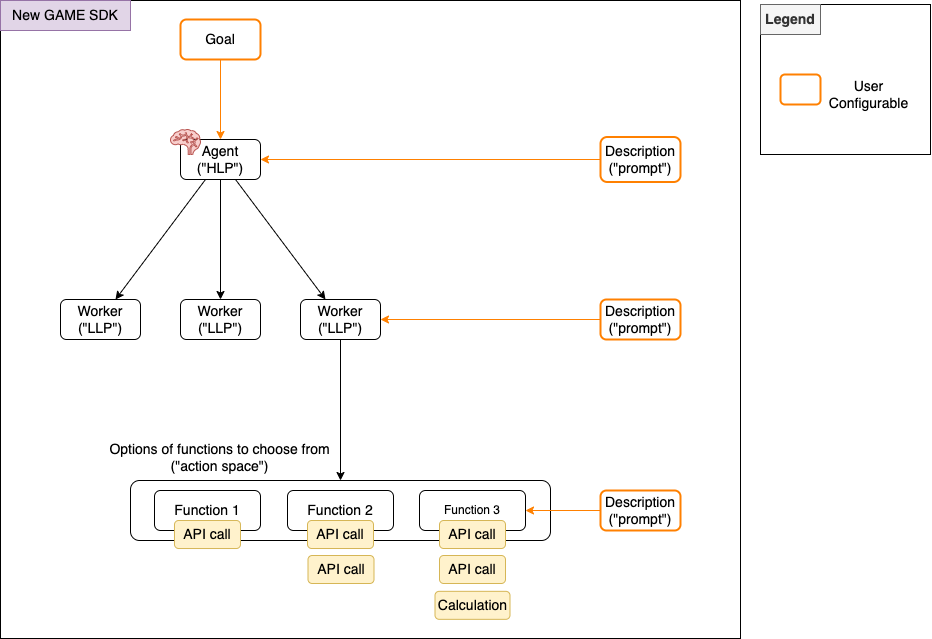

# GAME Python SDK Library
The GAME Python SDK is a library that allows you interact and develop agents powered by the GAME architecture.

There are 2 main folders in the source code (`src` folder)
1. `game`:

    Please refer to [`test_agent.py`](examples/game/test_agent.py) and [`test_worker.py`](examples/game/test_worker.py) for usage examples.

1. `hosted_game`<br/>

    This is a more abstracted version of the SDK which allows one to deploy a Twitter agent, which would then be hosted by GAME infrastructure. 
    
    Note that this README focuses on the code in the `game` folder. More details about `hosted_game` can be found in [`src/hosted_game/README.md`](src/game_sdk/hosted_game/README.md).

## About GAME Python SDK
Currently, the SDK (specifically the code in the `game` folder) allows you to develop your agents powered by the GAME architecture in its most fullest and most flexible form.


The python SDK is made up of 3 main components (Agent, Worker, function), each with configurable arguments.

Agent (a.k.a. [high level planner](https://whitepaper.virtuals.io/developer-documents/game-framework/game-overview#high-level-planner-hlp-context))
- Takes in a <b>Goal</b>
  - Drives the agents behaviour through the high level plan which influences the thinking and creation of tasks that would contribute towards this goal
- Takes in a <b>Description</b>
  - Combination of what was previously known as World Info + Agent Description
  - This include a description of the "world" the agent lives in, and the personality and background of the agent

Worker (a.k.a. [low-level planner](https://whitepaper.virtuals.io/developer-documents/game-framework/game-overview#low-level-planner-llp-context)) 
- Takes in a <b>Description</b>
  - Used to control which workers are called by the agent, based on the high-level plan and tasks created to contribute to the goal

Function
- Takes in a <b>Description</b>
  - Used to control which functions are called by the workers, based on each worker's low-level plan
  - This can be any python executable

## Features
- Develop your own custom agents for any application or platform. 
- Ability to control your agents and workers via descriptions (prompts)
- Full control of what the agent sees (state) and can do (actions/functions)
- Ability to fully customise functions. This could include various combinations of programmed logic. For example:
  - Calling an API to retrieve data
  - Calling an API to retrieve data, followed by custom calculations or data processing logic in python code
  - 2 API calls chained together (e.g. calling an API to retrieve web data, and then posting a tweet)

> ### ℹ️ Differences from the hosted GAME SDK version (i.e. `hosted_game`)
>
> - Ability to fully customise functions (previously, each function was a single API call)
> - Ability to control the low-level planner via description prompt (previously, only the high-level planner and functions could be controlled via description prompts)
> - The description defined in the agent is equivalent to what was previously known as world information and agent description

## Installation
```bash
pip install game_sdk
```

To get the latest version of the SDK, clone the repository and install from source:
```bash
git clone https://github.com/game-by-virtuals/game-python.git
cd game-python
pip install -e .
```
To exclude plugin folders in the installation, you may edit or remove the plugins paths in `[tool.hatch.build.targets.wheel]` as needed before running `pip install -e .`.

## Usage
1. `game`:
   - Request for a GAME API key (currently, this is only possible by contacting Virtuals support or DevRel team members via Discord or Telegram)
   - Store the key in a safe location, like a `.bashrc` or a `.zshrc` file. 
      
      ```bash
      export GAME_API_KEY="your_game_api_key"
      ```
   - Refer to [`src/game/README.md`](src/game_sdk/game/README.md) for usage guidelines, and refer to [`test_agent.py`](examples/game/test_agent.py) and [`test_worker.py`](examples/game/test_worker.py) for usage examples.

2. `hosted_game`<br/>
    - Open the [Virtuals Platform](https://app.virtuals.io/) and create/get an API key from the Agent Sandbox by clicking “Access G.A.M.E API” 
      
    
    - Store the key in a safe location, like a `.bashrc` or a `.zshrc` file. 
      
      ```bash
      export VIRTUALS_API_KEY="your_virtuals_api_key"
      ```
    - Refer to [`src/hosted_game/README.md`](src/game_sdk/hosted_game/README.md) for usage examples.

## About G.A.M.E.
GAME is a modular agentic framework which enables an agent to plan actions and make decisions autonomously based on information provided to it.

Please refer to our [whitepaper](https://whitepaper.virtuals.io/developer-documents/game-framework) for more information and resources.


## How to Contribute
Contributions are welcome, especially in the form of new plugins.

## Documentation
Detailed documentation to better understand the configurable components and the GAME architecture can be found on [here](https://whitepaper.virtuals.io/developer-documents/game-framework).

## Useful Resources
- [GAME TypeScript SDK](https://www.npmjs.com/package/@virtuals-protocol/game): The core logic of this SDK mirrors the logic of this python SDK if you prefer to develop your agents in TypeScript. Tyepscript SDK repository and contributed typescript plugins can be found [here](https://github.com/game-by-virtuals/game-node).
- [Hosted GAME Agent](./src/game_sdk/hosted_game/README.md): This SDK also enables configuration and deployment of an out-of-the-box hosted agent that can be used to interact with the Twitter/X platform, powered by GAME. This agent comes with existing functions/actions that can be used to interact with the Twitter/X platform and can be immediately hosted/deployed as you configure it. This is similar to configuring your agent in the [Agent Sandbox](https://game-lite.virtuals.io/) on the [Virtuals Platform](https://app.virtuals.io/) but through a developer-friendly SDK interface.